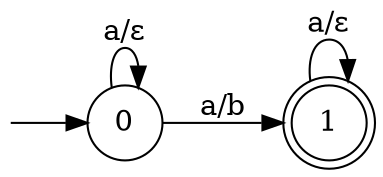
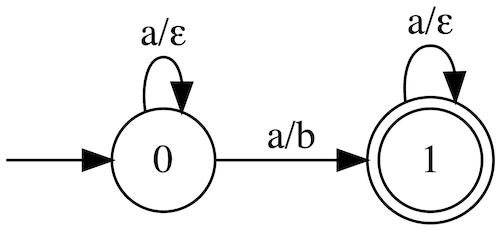

# Lexical Analysis using a Bimachine

## Lexer Generator API

[\[Implementation\]](https://github.com/deniskyashif/thesis/blob/master/project/src/Lexer/Lexer.cs)

### Usage

Generate a lexer by providing a set of lexical rules.

```cs
var lexer = Lexer.Create(new[]
{
    new Rule("[0-9]+\\.?[0-9]*", "NUM"),
    new Rule("[+*/-]", "OP"),
    new Rule("=", "EQ"),
    new Rule("[ \t\r\n]", "WS")
});
```

Set the input either as a string

```cs
lexer.Input = new InputStream("3.14+1.86=5");
```

or as a stream.

```cs
using var reader = new StreamReader("path/to/file.txt");
lexer.Input = new InputStream(reader);
```

Perform the tokenization.

```cs
foreach (Token token in lexer.GetNextToken())
    Console.WriteLine(token);
```

```sh
3.14+1.86=5
[@0,0:3='3.14',<NUM>]
[@1,4:4='+',<OP>]
[@2,5:8='1.86',<NUM>]
[@3,9:9='=',<EQ>]
[@4,10:10='5',<NUM>]
```

`Lexer.GetNextToken()` returns an iterator which yields a sequence of tokens one at a time. The `Token` class contains the following properties:

```csharp
public class Token
{
    public int Index { get; set; }
    public (int Start, int End) Position { get; set; }
    public string Text { get; set; }
    public string Type { get; set; }

    public override string ToString() =>
        $"[@{Index},{Position.Start}:{Position.End}='{Text}',<{Type}>]";
}
```

### Import/Export

Depending on the grammar, the lexer construction might take some time. Hence, once built, it can be exported as a binary file and then loaded in a project.

```cs
var lexer = Lexer.Create(grammar);
lexer.ExportToFile("lexout");
```

```cs
var lexer = Lexer.LoadFromFile("lexout");
```

### Example Lexers

[\[Tests\]](https://github.com/deniskyashif/thesis/blob/master/project/test/LexerTests.cs)

- Arithmetic expression
- JSON
- Regular expression
- Tokenizer for the English language

## Building Blocks

### Regular Expression Parser

[\[Implementation\]](https://github.com/deniskyashif/thesis/blob/master/project/src/RegExp.cs) [\[Tests\]](https://github.com/deniskyashif/thesis/blob/master/project/test/RegExpTests.cs)

#### Supported syntax

| Expression                                       | Example        |
|:-------------------------------------------------|:---------------|
| Concatenation                                    | `ab`           |
| Union                                            | `a\|b`         |
| Zero-or-more                                     | `a*`           |
| One-or-more                                      | `a+`           |
| Optional                                         | `a?`           |
| Grouping                                         | `(a\|b)*c`     |
| Char class                                       | `[a-z0-9,]`    |
| Negative char class                              | `[^a-z0-9,]`   |
| Match exactly 2 'a's                             | `a{2}`         |
| Match at least 2 'a's                            | `a{2,}`        |
| Match between 2 and 4 'a's                       | `a{2,4}`       |
| Escaping  (matches "a*")                         | `a\*`          |
| Escaping in char classes (match 'a', '-' or 'z') | `[a\-z]`       |

### Finite-state device construction and operations

- Finite-State Automata \[[NFA-Representation](https://github.com/deniskyashif/thesis/blob/master/project/src/Fsa/Fsa.cs)\] \[[DFA-Representation](https://github.com/deniskyashif/thesis/blob/master/project/src/Fsa/Dfsa.cs)\] \[[Constructions](https://github.com/deniskyashif/thesis/blob/master/project/src/Fsa/FsaBuilder.cs)\] \[[Operations](https://github.com/deniskyashif/thesis/blob/master/project/src/Fsa/FsaOperations.cs)\]
- Finite-State Transducer \[[Representation](https://github.com/deniskyashif/thesis/blob/master/project/src/Fst/Fst.cs)\] \[[Construction](https://github.com/deniskyashif/thesis/blob/master/project/src/Fst/FstBuilder.cs)\] \[[Operations](https://github.com/deniskyashif/thesis/blob/master/project/src/Fst/FstOperations.cs)\]
- Bimachine \[[Representation](https://github.com/deniskyashif/thesis/blob/master/project/src/Bimachine/Bimachine.cs)\] \[[Construction](https://github.com/deniskyashif/thesis/blob/598a69f5b1dccffd63f1935e6f14661c81d66ecb/project/src/Fst/FstOperations.cs#L351)\]

### Text Rewriters based on Regular Relations

[\[Implementations\]](https://github.com/deniskyashif/thesis/blob/master/project/src/Rewriters.cs) [\[Tests\]](https://github.com/deniskyashif/thesis/blob/master/project/test/RewriterTests.cs)

- Optional rewrite transducer
- Obligatory rewrite transducer
- Leftmost-longest match rewrite transducer

## Misc

- Trie (prefix tree) [implementation](https://github.com/deniskyashif/thesis/blob/master/project/src/Trie.cs)
- [Direct construction](https://github.com/deniskyashif/thesis/blob/master/project/src/MinDfaAlgorithm.cs) of a minimal, deterministic, acyclic finite-state automaton from a set of strings

Example usages of the APIs can be found in the [unit tests' project](https://github.com/deniskyashif/thesis/tree/master/project/test).

## GraphViz

The finite state devices `Fsa`, `Dfsa` and `Fst` can be exported as [GraphViz](https://www.graphviz.org/).

```cs
var fst = new RegExp("a+").Automaton
  .Product(new RegExp("b").Automaton)
  .ToRealTime()
  .Transducer
  .PseudoMinimal();

Console.WriteLine(fst.ToGraphViz());
```





## References

- [Finite-State Techniques Automata, Transducers and Bimachines](https://www.cambridge.org/core/books/finitestate-techniques/E21E748468F0310DA12A2CFAEB989185)
- [Regular Models of Phonological Rule
Systems](https://web.stanford.edu/~mjkay/Kaplan%26Kay.pdf)
- [Incremental Construction of Minimal
Acyclic Finite-State Automata](https://www.aclweb.org/anthology/J00-1002.pdf)
